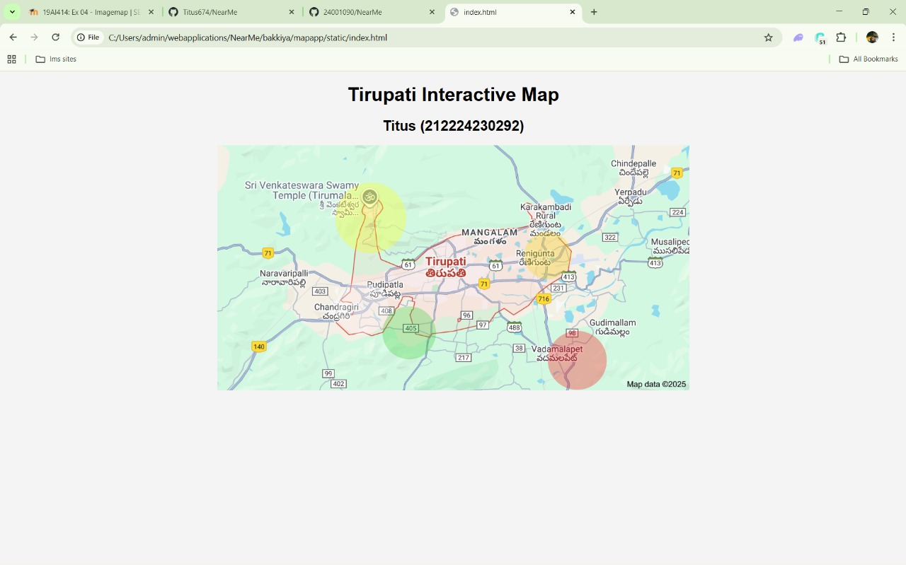
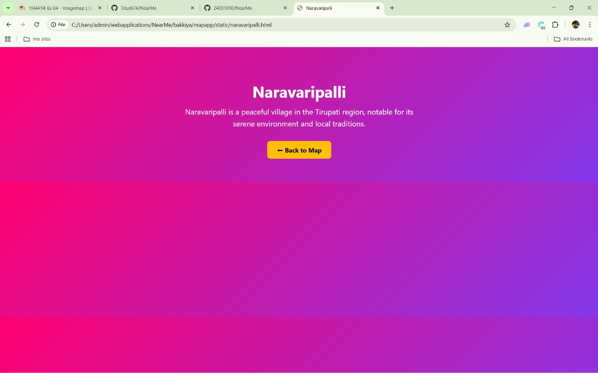
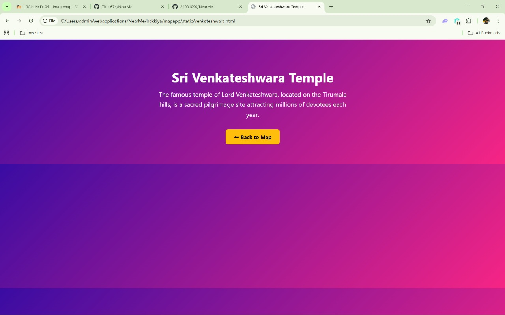
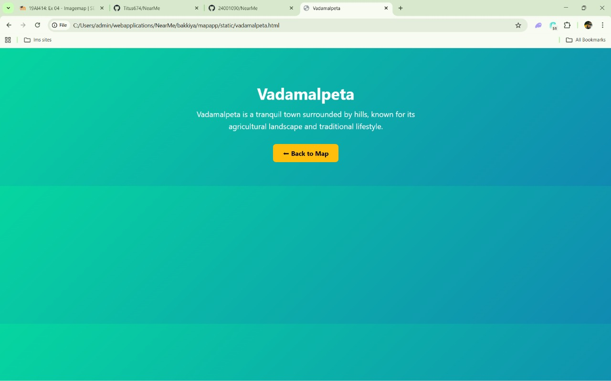
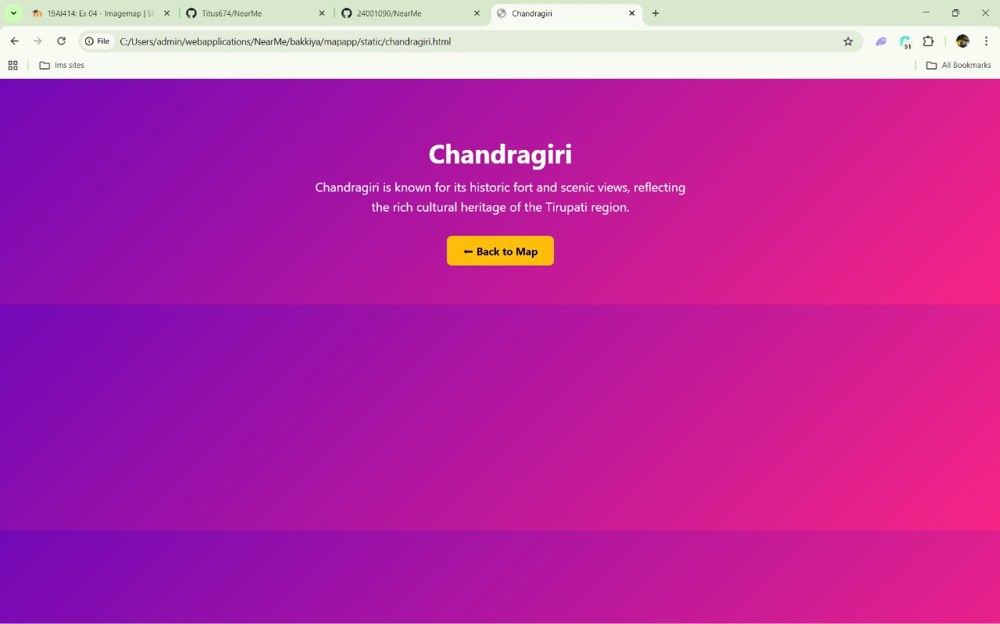

# Ex04 Places Around Me
## Date: 09-11-2025

## AIM
To develop a website to display details about the places around my house.

## DESIGN STEPS

### STEP 1
Create a Django admin interface.

### STEP 2
Download your city map from Google.

### STEP 3
Using ```<map>``` tag name the map.

### STEP 4
Create clickable regions in the image using ```<area>``` tag.

### STEP 5
Write HTML programs for all the regions identified.

### STEP 6
Execute the programs and publish them.

## CODE

index.html

```
<!DOCTYPE html>
<html lang="en">
<head>
  <meta charset="UTF-8">
  <meta name="viewport" content="width=device-width, initial-scale=1.0">
  <h1>Tirupati Interactive Map</h1>
  <h2> Titus (212224230292)</h2>
  <style>
    body {
      background: #f4f4f4;
      text-align: center;
      font-family: Arial, sans-serif;
    }
    .map {
      position: relative;
      display: inline-block;
    }
    .map img {
      width: 100%;
      max-width: 800px;
    }
    .hotspot {
      position: absolute;
      cursor: pointer;
      border-radius: 50%;
      opacity: 0.3;
      transition: 0.3s;
    }
    .hotspot:hover {
      opacity: 0.7;
      box-shadow: 0 0 10px 5px #fff;
    }
  </style>
</head>
<body>
  <div class="map">
    

    <!-- Big Yellow - Venkateshwara -->
    <a href="venkateshwara.html">
      <div class="hotspot" style="top:15%; left:25%; width:120px; height:120px; background:yellow;"></div>
    </a>

    <!-- Small Yellow - Renigunta -->
    <a href="renigunta.html">
      <div class="hotspot" style="top:35%; left:65%; width:80px; height:80px; background:gold;"></div>
    </a>

    <!-- Green - Chandragiri -->
    <a href="chandragiri.html">
      <div class="hotspot" style="top:65%; left:35%; width:90px; height:90px; background:limegreen;"></div>
    </a>

    <!-- Red - Vadamalpeta -->
    <a href="vadamalpeta.html">
      <div class="hotspot" style="top:75%; left:70%; width:100px; height:100px; background:red;"></div>
    </a>

    <!-- White - Naravaripalli -->
    <a href="naravaripalli.html">
      <div class="hotspot" style="top:55%; left:25%; width:90px; height:90px; background:white;"></div>
    </a>
  </div>
</body>
</html>

```
chandragiri.html

```

<!DOCTYPE html>
<html lang="en">
<head>
<meta charset="UTF-8">
<meta name="viewport" content="width=device-width, initial-scale=1.0">
<title>Chandragiri</title>
<style>
  body{margin:0;font-family:"Segoe UI",sans-serif;background:linear-gradient(135deg,#7209b7,#f72585);color:#fff;text-align:center;padding:60px 20px}
  h1{font-size:2.5em;margin-bottom:10px}
  p{font-size:1.2em;max-width:600px;margin:0 auto 30px;line-height:1.6}
  a{display:inline-block;padding:12px 25px;background:#ffbe0b;color:black;text-decoration:none;border-radius:8px;font-weight:bold;transition:0.3s}
  a:hover{background:#ffd60a}
</style>
</head>
<body>
  <h1>Chandragiri</h1>
  <p>Chandragiri is known for its historic fort and scenic views, reflecting the rich cultural heritage of the Tirupati region.</p>
  <a href="index.html">⬅ Back to Map</a>
</body>
</html>

```
narvapalli.html

```

<!DOCTYPE html>
<html lang="en">
<head>
<meta charset="UTF-8">
<meta name="viewport" content="width=device-width, initial-scale=1.0">
<title>Naravaripalli</title>
<style>
  body{margin:0;font-family:"Segoe UI",sans-serif;background:linear-gradient(135deg,#ff006e,#8338ec);color:#fff;text-align:center;padding:60px 20px}
  h1{font-size:2.5em;margin-bottom:10px}
  p{font-size:1.2em;max-width:600px;margin:0 auto 30px;line-height:1.6}
  a{display:inline-block;padding:12px 25px;background:#ffbe0b;color:black;text-decoration:none;border-radius:8px;font-weight:bold;transition:0.3s}
  a:hover{background:#ffd60a}
</style>
</head>
<body>
  <h1>Naravaripalli</h1>
  <p>Naravaripalli is a peaceful village in the Tirupati region, notable for its serene environment and local traditions.</p>
  <a href="index.html">⬅ Back to Map</a>
</body>
</html>

```

renigunta.html

```

<!DOCTYPE html>
<html lang="en">
<head>
<meta charset="UTF-8">
<meta name="viewport" content="width=device-width, initial-scale=1.0">
<title>Renigunta</title>
<style>
  body{margin:0;font-family:"Segoe UI",sans-serif;background:linear-gradient(135deg,#4361ee,#4cc9f0);color:#fff;text-align:center;padding:60px 20px}
  h1{font-size:2.5em;margin-bottom:10px}
  p{font-size:1.2em;max-width:600px;margin:0 auto 30px;line-height:1.6}
  a{display:inline-block;padding:12px 25px;background:#ffbe0b;color:black;text-decoration:none;border-radius:8px;font-weight:bold;transition:0.3s}
  a:hover{background:#ffd60a}
</style>
</head>
<body>
  <h1>Renigunta</h1>
  <p>Renigunta is a key railway junction near Tirupati, serving as a gateway to pilgrims traveling by train from across India.</p>
  <a href="index.html">⬅ Back to Map</a>
</body>
</html>

```

vadamalpeta.html

```
<!DOCTYPE html>
<html lang="en">
<head>
<meta charset="UTF-8">
<meta name="viewport" content="width=device-width, initial-scale=1.0">
<title>Vadamalpeta</title>
<style>
  body{margin:0;font-family:"Segoe UI",sans-serif;background:linear-gradient(135deg,#06d6a0,#118ab2);color:#fff;text-align:center;padding:60px 20px}
  h1{font-size:2.5em;margin-bottom:10px}
  p{font-size:1.2em;max-width:600px;margin:0 auto 30px;line-height:1.6}
  a{display:inline-block;padding:12px 25px;background:#ffbe0b;color:black;text-decoration:none;border-radius:8px;font-weight:bold;transition:0.3s}
  a:hover{background:#ffd60a}
</style>
</head>
<body>
  <h1>Vadamalpeta</h1>
  <p>Vadamalpeta is a tranquil town surrounded by hills, known for its agricultural landscape and traditional lifestyle.</p>
  <a href="index.html">⬅ Back to Map</a>
</body>
</html>

```

venkateshwara_swami_temple.html

```

<!DOCTYPE html>
<html lang="en">
<head>
<meta charset="UTF-8">
<meta name="viewport" content="width=device-width, initial-scale=1.0">
<title>Sri Venkateshwara Temple</title>
<style>
  body {
    margin: 0;
    font-family: "Segoe UI", sans-serif;
    background: linear-gradient(135deg, #3a0ca3, #f72585);
    color: white;
    text-align: center;
    padding: 60px 20px;
  }
  h1 { font-size: 2.5em; margin-bottom: 10px; }
  p { font-size: 1.2em; max-width: 600px; margin: 0 auto 30px; line-height: 1.6; }
  a {
    display: inline-block;
    padding: 12px 25px;
    background: #ffbe0b;
    color: black;
    text-decoration: none;
    border-radius: 8px;
    font-weight: bold;
    transition: 0.3s;
  }
  a:hover { background: #ffd60a; }
</style>
</head>
<body>
  <h1>Sri Venkateshwara Temple</h1>
  <p>The famous temple of Lord Venkateshwara, located on the Tirumala hills, is a sacred pilgrimage site attracting millions of devotees each year.</p>
  <a href="index.html">⬅ Back to Map</a>
</body>
</html>

```


## OUTPUT









## RESULT
The program for implementing image maps using HTML is executed successfully.
